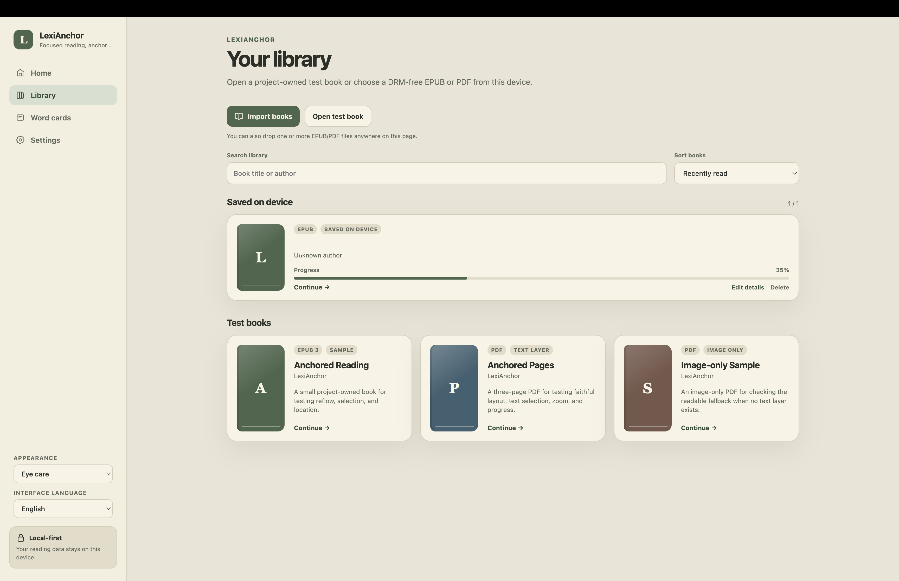
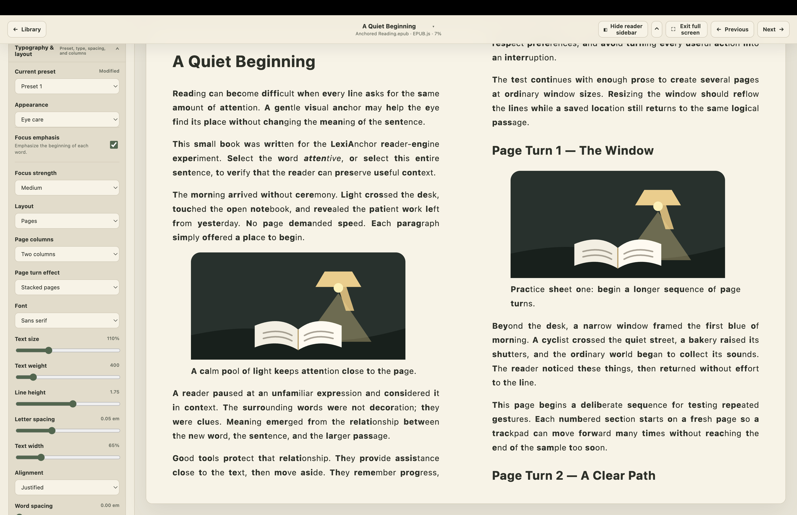
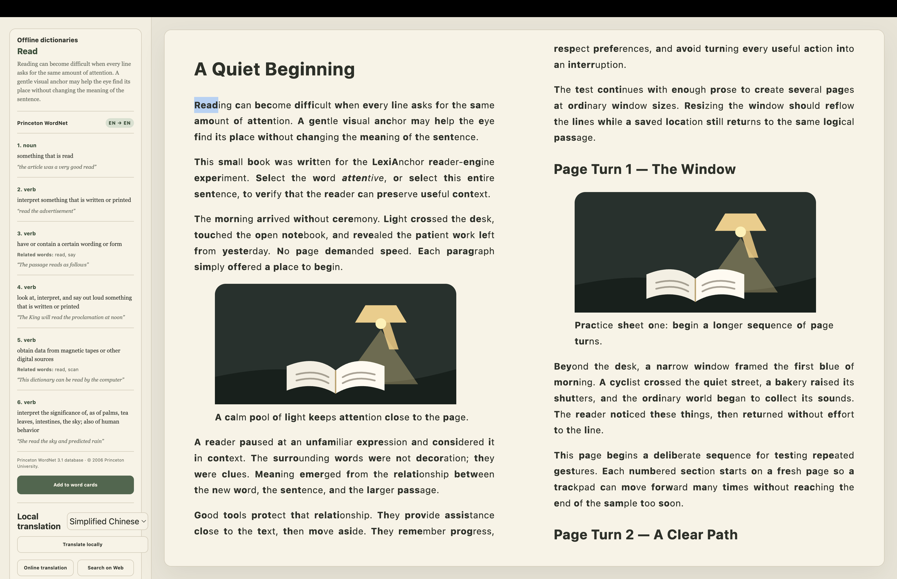
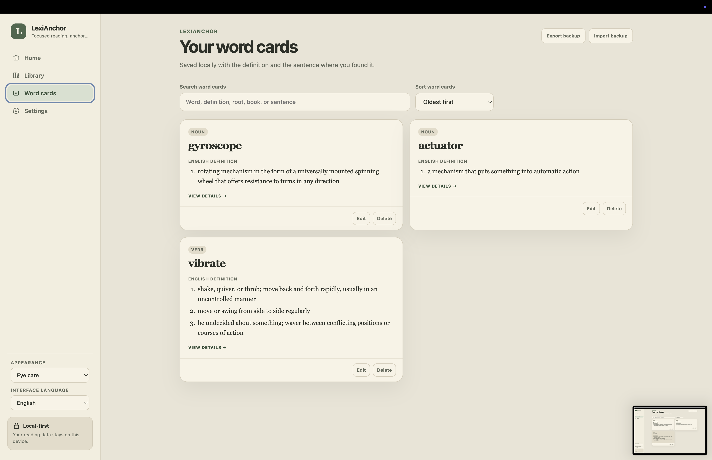

# LexiAnchor

[中文](#中文) · [English](#english) · [Français](#français)

---

## 中文

一款本地优先的 EPUB / PDF 阅读器，帮助你专注阅读、查询单词、翻译内容并制作词卡。

> 本项目由作者提出需求、实际测试并持续反馈，AI 辅助设计、编码、自动化测试与文档。

> [!IMPORTANT]
> LexiAnchor 目前是测试版本。请只打开你信任的、无 DRM 的 EPUB 或 PDF 文件，并定期备份重要数据。

### 功能一览

#### 本地书库



导入、搜索和整理 EPUB / PDF，查看每本书的阅读进度，并从上次停下的位置继续阅读。

#### 自定义阅读页面



调整主题、字体、字号、字重、行距、字间距和文字宽度；还可以选择单栏 / 双栏、连续滚动 / 水平翻页及翻页效果，并把配置保存为预设。

阅读 EPUB 时，还可以开启英文单词前半部分加粗，为视线提供落点，辅助专注阅读。

#### 划词查询与翻译



选中单词即可在阅读页面旁查看多条英英释义和例句，也可以进行本地翻译、在线翻译、网页搜索或把单词加入词卡。

#### 词卡



词卡会保存单词和英英释义，并支持查看详细内容、搜索、按时间排序、编辑、删除以及导入 / 导出备份。

### 1. 我应该下载哪个文件？

前往 [LexiAnchor 最新正式版下载页面](https://github.com/GuGuGu-coocoo/LexiAnchor/releases/latest)，根据电脑选择：

| 你的电脑                                           | 下载文件                     |
| -------------------------------------------------- | ---------------------------- |
| 配备 Apple 芯片的 Mac（M1、M2、M3、M4 或更新型号） | `LexiAnchor-macOS-arm64.zip` |
| 64 位 Windows 10 / 11 电脑                         | `LexiAnchor-Windows-x64.zip` |

目前没有 Intel Mac、Windows ARM 或 Linux 安装包。不要下载 GitHub 自动生成的 `Source code` 文件——它们是给开发者看的，不能直接打开阅读器。

### 2. Mac 安装步骤

1. 下载 `LexiAnchor-macOS-arm64.zip`。
2. 打开“下载”文件夹，双击 ZIP 文件解压。
3. 把解压出来的 `LexiAnchor.app` 拖进“应用程序”文件夹。
4. 第一次启动时，不要直接双击。按住 `Control` 键并点按 `LexiAnchor.app`，选择“打开”。
5. 如果系统再次询问，继续选择“打开”。

当前版本尚未经过 Apple 公证，所以 macOS 可能显示安全提醒。这不代表文件损坏。请确保文件来自本仓库的正式 Release 页面。

如果你的 Mac 显示“此应用需要 Apple 芯片”，说明你使用的是 Intel Mac，当前安装包不支持这台电脑。

### 3. Windows 安装步骤

1. 下载 `LexiAnchor-Windows-x64.zip`。
2. 在“下载”文件夹中右键点击 ZIP，选择“全部解压”。
3. 打开解压后的完整文件夹。不要只把 `LexiAnchor.exe` 单独拖出来。
4. 双击 `LexiAnchor.exe`。
5. 如果 Microsoft Defender SmartScreen 显示提醒，先确认文件来自本仓库，然后点击“更多信息” → “仍要运行”。

当前版本还没有 Windows 代码签名，因此首次启动可能出现安全提醒。整个解压文件夹都属于应用程序，使用过程中不要随意删除里面的文件。

### 4. 如何升级已有版本？

LexiAnchor 会在启动时检查最新正式版；你也可以打开“设置 → 应用更新”手动检查。应用只会打开官方 Release 下载页面，不会自动下载或安装。

1. 建议先打开“设置 → 本地存储 → 应用数据备份”，勾选“包含书籍文件”并导出完整备份。
2. **完全退出所有正在运行的 LexiAnchor，不要同时运行新旧副本。**
3. 从上面的最新正式版页面下载对应系统的 ZIP。
4. Mac：解压后把新的 `LexiAnchor.app` 拖入“应用程序”并选择替换。Windows：把新版完整解压到一个新文件夹，不要与旧版文件混合。
5. 打开新版 LexiAnchor。

正常替换应用程序不会删除原来的书籍、阅读位置、词卡或阅读预设。这些数据保存在独立的 LexiAnchor 用户资料目录中，而不是 `.app` 或 Windows 程序文件夹内。不要手动删除系统中的 LexiAnchor 应用数据。

### 5. 第一次使用

1. 启动 LexiAnchor。
2. 在“书库”页面点击导入按钮，选择一本 `.epub` 或 `.pdf` 书籍；也可以把文件直接拖进窗口。
3. 等待书籍出现在书库中。
4. 点击书籍封面或标题开始阅读。
5. 用以下方式翻页：
   - 左右翻页模式：双指在触控板上左右滑动，或按键盘 `←` / `→`。
   - 上下连续模式：双指上下滚动，或使用鼠标滚轮。
6. 选中英文单词即可查看释义、翻译并保存为词卡。
7. 点击阅读界面的设置按钮，可以调整主题、字体、字号、行距、页边距、单栏 / 双栏和翻页方式。
8. 按 `Esc` 退出全屏。

阅读进度和外观设置会自动保存在当前电脑上。侧边栏开关、全屏标题栏自动隐藏和阅读布局也会保留到下次启动。

### 6. 常用功能

- **目录跳转：** 点击阅读器顶部的章节标题，在下拉菜单中选择章节。
- **划词翻译：** 用鼠标拖动选中文字，翻译浮窗会显示在选区附近。
- **词卡：** 在划词结果中保存单词；打开词卡可以查看完整释义，左右滑动可切换卡片。
- **阅读外观：** 在设置中调整字体、字号、行距、字间距、页边距、主题和分栏。
- **外观预设：** 保存常用配置、覆盖当前预设，或一键恢复默认设置。
- **全屏阅读：** 进入全屏后，标题栏可以自动隐藏；鼠标移到窗口顶部时会重新出现。
- **EPUB / PDF 布局：** 两种格式都支持上下连续阅读和左右分页阅读。

### 7. 书籍和数据保存在哪里？

LexiAnchor 采用本地优先设计。导入的书籍、阅读进度、词卡、词典和设置主要保存在你的电脑上，不会自动上传到云端。

卸载应用、清除浏览器数据或手动删除应用数据前，请先在设置中导出备份。应用数据备份可以选择包含原始书籍；词卡也可以单独导出为 JSON 文件。

### 8. 常见问题

**双击应用没有反应怎么办？**

Mac 请使用“按住 `Control` 点按 → 打开”；Windows 请先完整解压 ZIP，再运行文件夹中的 `LexiAnchor.exe`。

**为什么有些 EPUB 打不开？**

当前仅支持无 DRM 的 EPUB 2 / EPUB 3。来自部分商业书店、带 DRM 保护的电子书无法导入。

**为什么 PDF 中不能选中文字？**

扫描版 PDF 的每一页实际上是一张图片，没有文字层，因此无法正常划词。请换用带文字层的 PDF。

**为什么翻译没有结果？**

离线词典可以直接使用；句子翻译需要先在设置中下载对应的离线翻译模型。在线翻译和网页搜索需要网络连接。

**可以直接把 `.app` 或 Windows 文件夹发给别人吗？**

可以，但推荐直接把本 Release 页面的链接发给对方，这样更容易下载到完整、未被改动的文件。Mac 用户需要 Apple 芯片，Windows 用户需要 64 位 Windows 10 / 11。

**网页版本在哪里？**

目前没有公开部署的网页版本。普通用户请使用上面的桌面版；开发者可以按照文末步骤在本机运行网页端。

### 9. 开发者指南

#### 环境要求

- Node.js 24 LTS
- pnpm 11
- 打包桌面端需要 macOS 或 Windows

#### 本地运行

```bash
pnpm install

# 网页端：打开终端显示的地址，通常为 http://localhost:5173
pnpm dev:web

# 桌面端
pnpm dev:desktop
```

localhost 只有在开发命令持续运行时才能访问；关闭终端后，本地网页服务也会停止。

#### 打包与测试

```bash
# 为当前操作系统生成桌面测试包
pnpm --filter @lexianchor/desktop make

# 运行格式、代码规范、类型检查与单元测试
pnpm check

# 运行浏览器端到端测试
pnpm test:e2e
```

书籍、下载的词典、翻译模型、本地数据库、测试文档和内部开发文档不会提交到 Git。

### 许可证

[MIT](LICENSE) · [Third-party licenses and resource notices](THIRD-PARTY-NOTICES.md)

[↑ 返回顶部](#lexianchor)

---

## English

A local-first EPUB / PDF reader for focused reading, dictionary lookup, translation, and vocabulary cards.

> The author defines the requirements, tests the app, and provides ongoing feedback; AI assists with design, coding, automated testing, and documentation.

> [!IMPORTANT]
> LexiAnchor is currently a test release. Open only trusted, DRM-free EPUB or PDF files and back up important data regularly.

### Feature tour

#### Local library


Import, search, and organize EPUB / PDF books, see your progress, and continue where you stopped.

#### Custom reading layout


Adjust the theme, font, size, weight, line height, letter spacing, and text width. Choose one or two columns, continuous scrolling or horizontal pages, a page-turn effect, and save everything as a preset.

When reading EPUBs, you can also bold the beginning of English words to provide visual anchors and support more focused reading.

#### Selection lookup and translation


Select a word to see multiple English definitions and examples beside the page. Translate locally or online, search the Web, or add the word to your cards.

#### Word cards


Word cards preserve words and English definitions, with detailed views, search, time-based sorting, editing, deletion, and backup import / export.

### 1. Which file should I download?

Open the [latest stable LexiAnchor download page](https://github.com/GuGuGu-coocoo/LexiAnchor/releases/latest) and choose:

| Your computer                                     | Download                     |
| ------------------------------------------------- | ---------------------------- |
| Mac with Apple silicon (M1, M2, M3, M4, or newer) | `LexiAnchor-macOS-arm64.zip` |
| 64-bit Windows 10 or 11 PC                        | `LexiAnchor-Windows-x64.zip` |

There is no build for Intel Macs, Windows on ARM, or Linux yet. Do not download the automatically generated `Source code` archives unless you are a developer; they are not runnable applications.

### 2. Install on a Mac

1. Download `LexiAnchor-macOS-arm64.zip`.
2. Open your Downloads folder and double-click the ZIP file.
3. Drag `LexiAnchor.app` into the Applications folder.
4. For the first launch, hold `Control`, click `LexiAnchor.app`, and choose **Open**.
5. If macOS asks again, choose **Open** once more.

This test build is not notarized by Apple, so macOS may show a security warning. Make sure you downloaded it from this repository's official Release page.

If macOS says the app requires Apple silicon, your Mac has an Intel processor and is not supported by the current build.

### 3. Install on Windows

1. Download `LexiAnchor-Windows-x64.zip`.
2. Right-click the ZIP file and select **Extract All**.
3. Open the complete extracted folder. Do not move `LexiAnchor.exe` out by itself.
4. Double-click `LexiAnchor.exe`.
5. If Microsoft Defender SmartScreen appears, verify that the file came from this repository, then select **More info** → **Run anyway**.

This test build is not code-signed, so Windows may display a warning on first launch. The entire extracted folder belongs to the application; do not delete individual files from it.

### 4. How do I update an existing installation?

LexiAnchor checks for the latest stable release when it starts. You can also use **Settings → Application updates → Check for updates**. The app only opens the official Release page; it never downloads or installs an update automatically.

1. We recommend opening **Settings → Local storage → Application backup**, selecting **Include book files**, and exporting a complete backup.
2. **Quit every running copy of LexiAnchor completely. Never run the old and new copies at the same time.**
3. Download the ZIP for your system from the latest stable release page above.
4. Mac: extract the ZIP, drag the new `LexiAnchor.app` into Applications, and choose **Replace**. Windows: extract the complete new version into a new folder; do not mix it with the old files.
5. Open the new version of LexiAnchor.

Normally replacing the application does not delete your books, reading positions, word cards, or appearance presets. They live in a separate LexiAnchor user-data profile, not inside the `.app` or Windows program folder. Do not manually delete LexiAnchor's system application data.

### 5. Your first book

1. Start LexiAnchor.
2. On the Library page, click the import button and select an `.epub` or `.pdf` book. You can also drag the file into the window.
3. Wait for the book to appear in your library.
4. Click its cover or title to start reading.
5. Navigate in either mode:
   - Horizontal pages: swipe left or right with two fingers, or press `←` / `→`.
   - Continuous vertical reading: scroll with two fingers or use the mouse wheel.
6. Select an English word to see definitions and translations or save it as a word card.
7. Open the reader settings to change the theme, font, size, spacing, margins, one/two-column layout, and page-turning mode.
8. Press `Esc` to leave full screen.

Reading progress and appearance settings are saved automatically on this computer. Sidebar visibility, the full-screen toolbar option, and the reading layout are also restored the next time you start the app.

### 6. Main features

- **Table of contents:** Click the chapter title in the top bar and choose a chapter from the menu.
- **Selection lookup:** Drag across text; a translation panel appears near the selection.
- **Word cards:** Save a selected word, open a card for full definitions, and swipe left or right between cards.
- **Reading appearance:** Adjust the font, size, line spacing, letter spacing, margins, theme, and column count.
- **Appearance presets:** Save a new preset, update the active preset, or restore all defaults in one click.
- **Full-screen reading:** The top bar can hide automatically and reappear when the pointer reaches the top of the window.
- **EPUB and PDF layouts:** Both formats support continuous vertical reading and horizontal pagination.

### 7. Where is my data?

LexiAnchor is local-first. Imported books, reading progress, word cards, dictionaries, and settings are primarily stored on your computer and are not automatically uploaded to a cloud service.

Before uninstalling the app, clearing browser data, or deleting application data, export a backup from Settings. An application backup can optionally include the original books. Word cards can also be exported separately as JSON.

### 8. Troubleshooting

**Nothing happens when I open the app.**

On a Mac, use `Control`-click → **Open**. On Windows, extract the entire ZIP before launching `LexiAnchor.exe`.

**Why will my EPUB not open?**

LexiAnchor supports DRM-free EPUB 2 and EPUB 3 files. Books protected by a commercial store's DRM cannot be imported.

**Why can I not select text in a PDF?**

A scanned PDF contains page images instead of a text layer. Word selection requires a PDF with real text.

**Why is there no translation result?**

Offline dictionaries work directly. Sentence translation requires the matching offline model to be downloaded in Settings. Online translation and Web search require an internet connection.

**Can I send the `.app` or Windows folder to someone else?**

Yes, but sharing the official Release link is safer and less likely to produce an incomplete copy. The recipient needs an Apple-silicon Mac or a 64-bit Windows 10 / 11 computer.

**Where is the Web version?**

There is no publicly hosted Web version yet. Regular users should use a desktop download. Developers can run the Web app locally using the instructions at the end of this README.

### 9. Developer guide

#### Requirements

- Node.js 24 LTS
- pnpm 11
- macOS or Windows for desktop packaging

#### Run locally

```bash
pnpm install

# Web app: open the address printed in the terminal, normally http://localhost:5173
pnpm dev:web

# Desktop app
pnpm dev:desktop
```

localhost only works while the development command is running. Closing the terminal stops the local Web server.

#### Package and test

```bash
# Create a desktop test package for the current operating system
pnpm --filter @lexianchor/desktop make

# Run formatting, lint, type checks, and unit tests
pnpm check

# Run end-to-end browser tests
pnpm test:e2e
```

Books, downloaded dictionaries, translation models, local databases, test documents, and internal development documents are intentionally excluded from Git.

### License

[MIT](LICENSE) · [Third-party licenses and resource notices](THIRD-PARTY-NOTICES.md)

[↑ Back to top](#lexianchor)

---

## Français

Un lecteur EPUB / PDF local, conçu pour lire sans distraction, consulter le dictionnaire, traduire et créer des fiches de vocabulaire.

> L’auteur définit les besoins, teste l’application et fournit des retours continus ; l’IA aide à la conception, au code, aux tests automatisés et à la documentation.

> [!IMPORTANT]
> LexiAnchor est actuellement en version de test. Ouvrez uniquement des fichiers EPUB ou PDF fiables et sans DRM, et sauvegardez régulièrement vos données importantes.

### Aperçu des fonctionnalités

#### Bibliothèque locale


Importez, recherchez et organisez vos livres EPUB / PDF, consultez votre progression et reprenez où vous vous êtes arrêté.

#### Mise en page personnalisée


Réglez le thème, la police, la taille, la graisse, l'interligne, l'espacement des lettres et la largeur du texte. Choisissez une ou deux colonnes, le défilement continu ou les pages horizontales, un effet de changement de page, puis enregistrez le tout comme préréglage.

Pour les EPUB, vous pouvez aussi mettre en gras le début des mots anglais afin de créer des repères visuels et de favoriser une lecture plus attentive.

#### Recherche et traduction


Sélectionnez un mot pour afficher plusieurs définitions et exemples en anglais à côté de la page. Traduisez-le localement ou en ligne, recherchez-le sur le Web ou ajoutez-le à vos fiches.

#### Fiches de vocabulaire


Les fiches conservent les mots et leurs définitions anglaises, avec affichage détaillé, recherche, tri chronologique, modification, suppression et importation / exportation des sauvegardes.

### 1. Quel fichier dois-je télécharger ?

Ouvrez la [page de téléchargement de la dernière version stable de LexiAnchor](https://github.com/GuGuGu-coocoo/LexiAnchor/releases/latest), puis choisissez :

| Votre ordinateur                                     | Fichier à télécharger        |
| ---------------------------------------------------- | ---------------------------- |
| Mac avec puce Apple (M1, M2, M3, M4 ou plus récente) | `LexiAnchor-macOS-arm64.zip` |
| PC 64 bits sous Windows 10 ou 11                     | `LexiAnchor-Windows-x64.zip` |

Il n'existe pas encore de version pour les Mac Intel, Windows ARM ou Linux. Ne téléchargez pas les archives `Source code` générées automatiquement, sauf si vous êtes développeur : elles ne contiennent pas une application prête à lancer.

### 2. Installation sur Mac

1. Téléchargez `LexiAnchor-macOS-arm64.zip`.
2. Ouvrez le dossier Téléchargements et double-cliquez sur le fichier ZIP.
3. Faites glisser `LexiAnchor.app` dans le dossier Applications.
4. Lors du premier lancement, maintenez la touche `Control`, cliquez sur `LexiAnchor.app`, puis choisissez **Ouvrir**.
5. Si macOS vous demande une confirmation, choisissez de nouveau **Ouvrir**.

Cette version de test n'est pas certifiée par Apple. macOS peut donc afficher un avertissement de sécurité. Vérifiez que le fichier vient bien de la page Releases officielle de ce dépôt.

Si macOS indique que l'application nécessite une puce Apple, votre Mac utilise un processeur Intel et n'est pas compatible avec la version actuelle.

### 3. Installation sous Windows

1. Téléchargez `LexiAnchor-Windows-x64.zip`.
2. Faites un clic droit sur le fichier ZIP, puis choisissez **Extraire tout**.
3. Ouvrez le dossier extrait complet. Ne déplacez pas `LexiAnchor.exe` tout seul.
4. Double-cliquez sur `LexiAnchor.exe`.
5. Si Microsoft Defender SmartScreen affiche un avertissement, vérifiez que le fichier vient de ce dépôt, puis choisissez **Informations complémentaires** → **Exécuter quand même**.

Cette version de test n'est pas signée numériquement. Windows peut donc afficher un avertissement au premier lancement. Tous les fichiers du dossier extrait sont nécessaires à l'application : ne les supprimez pas séparément.

### 4. Comment mettre à jour une installation existante ?

LexiAnchor vérifie la dernière version stable au démarrage. Vous pouvez aussi utiliser **Réglages → Mises à jour de l'application → Rechercher les mises à jour**. L'application ouvre uniquement la page Releases officielle ; elle ne télécharge et n'installe jamais une mise à jour automatiquement.

1. Nous recommandons d'ouvrir **Réglages → Stockage local → Sauvegarde de l'application**, de sélectionner **Inclure les fichiers des livres**, puis d'exporter une sauvegarde complète.
2. **Quittez complètement toutes les copies de LexiAnchor. N'exécutez jamais l'ancienne et la nouvelle version en même temps.**
3. Téléchargez le fichier ZIP correspondant à votre système depuis la page de la dernière version stable.
4. Mac : extrayez le ZIP, faites glisser le nouveau `LexiAnchor.app` dans Applications et choisissez **Remplacer**. Windows : extrayez toute la nouvelle version dans un nouveau dossier, sans mélanger ses fichiers avec ceux de l'ancienne version.
5. Ouvrez la nouvelle version de LexiAnchor.

Le remplacement normal de l'application ne supprime ni vos livres, ni vos positions de lecture, ni vos fiches, ni vos préréglages. Ces données se trouvent dans un profil utilisateur LexiAnchor séparé, et non dans le fichier `.app` ou le dossier du programme Windows. Ne supprimez pas manuellement les données système de LexiAnchor.

### 5. Ouvrir votre premier livre

1. Lancez LexiAnchor.
2. Dans la Bibliothèque, cliquez sur le bouton d'importation et choisissez un livre `.epub` ou `.pdf`. Vous pouvez aussi faire glisser le fichier dans la fenêtre.
3. Attendez que le livre apparaisse dans la bibliothèque.
4. Cliquez sur sa couverture ou son titre pour commencer la lecture.
5. Utilisez le mode qui vous convient :
   - Pages horizontales : balayez vers la gauche ou la droite avec deux doigts, ou appuyez sur `←` / `→`.
   - Lecture verticale continue : faites défiler avec deux doigts ou avec la molette de la souris.
6. Sélectionnez un mot anglais pour afficher ses définitions et traductions, ou pour l'enregistrer comme fiche de vocabulaire.
7. Ouvrez les réglages du lecteur pour modifier le thème, la police, la taille, les espacements, les marges, l'affichage sur une/deux colonnes et le mode de changement de page.
8. Appuyez sur `Esc` pour quitter le plein écran.

La progression de lecture et les réglages d'affichage sont enregistrés automatiquement sur cet ordinateur. L'état de la barre latérale, l'option de masquage de la barre en plein écran et la mise en page sont également restaurés au prochain démarrage.

### 6. Fonctions principales

- **Table des matières :** cliquez sur le titre du chapitre dans la barre supérieure, puis choisissez un chapitre.
- **Traduction d'une sélection :** sélectionnez du texte ; un panneau de traduction apparaît près de la sélection.
- **Fiches de vocabulaire :** enregistrez un mot, ouvrez sa fiche pour voir les définitions complètes et balayez à gauche ou à droite pour changer de fiche.
- **Apparence de lecture :** réglez la police, la taille, l'interligne, l'espacement des lettres, les marges, le thème et le nombre de colonnes.
- **Préréglages :** enregistrez un nouveau préréglage, remplacez le préréglage actif ou revenez aux réglages par défaut en un clic.
- **Lecture en plein écran :** la barre supérieure peut se masquer automatiquement et réapparaître lorsque le pointeur atteint le haut de la fenêtre.
- **Mise en page EPUB / PDF :** les deux formats proposent la lecture verticale continue et la pagination horizontale.

### 7. Où sont enregistrées mes données ?

LexiAnchor fonctionne en priorité en local. Les livres importés, la progression, les fiches, les dictionnaires et les réglages sont principalement conservés sur votre ordinateur et ne sont pas envoyés automatiquement dans le cloud.

Avant de désinstaller l'application, d'effacer les données du navigateur ou de supprimer les données de l'application, exportez une sauvegarde depuis les Réglages. La sauvegarde de l'application peut inclure les livres originaux. Les fiches de vocabulaire peuvent aussi être exportées séparément au format JSON.

### 8. Problèmes fréquents

**Rien ne se passe lorsque j'ouvre l'application.**

Sur Mac, faites `Control`-clic → **Ouvrir**. Sous Windows, extrayez tout le contenu du ZIP avant de lancer `LexiAnchor.exe`.

**Pourquoi mon EPUB ne s'ouvre-t-il pas ?**

LexiAnchor prend en charge les fichiers EPUB 2 et EPUB 3 sans DRM. Les livres protégés par le DRM d'une boutique commerciale ne peuvent pas être importés.

**Pourquoi ne puis-je pas sélectionner le texte d'un PDF ?**

Un PDF numérisé contient des images de pages plutôt qu'une couche de texte. La sélection de mots nécessite un PDF contenant du vrai texte.

**Pourquoi la traduction ne donne-t-elle aucun résultat ?**

Les dictionnaires hors ligne fonctionnent directement. Pour traduire des phrases, téléchargez d'abord le modèle hors ligne correspondant dans les Réglages. La traduction en ligne et la recherche Web nécessitent une connexion Internet.

**Puis-je envoyer le fichier `.app` ou le dossier Windows à quelqu'un ?**

Oui, mais il est préférable de partager le lien officiel de la Release afin d'éviter une copie incomplète. Le destinataire doit posséder un Mac avec puce Apple ou un PC 64 bits sous Windows 10 / 11.

**Où se trouve la version Web ?**

Il n'existe pas encore de version Web publique. Les utilisateurs ordinaires doivent télécharger l'application de bureau. Les développeurs peuvent lancer la version Web localement en suivant les instructions ci-dessous.

### 9. Guide de développement

#### Prérequis

- Node.js 24 LTS
- pnpm 11
- macOS ou Windows pour créer les paquets de bureau

#### Exécution locale

```bash
pnpm install

# Application Web : ouvrez l’adresse affichée dans le terminal, généralement http://localhost:5173
pnpm dev:web

# Application de bureau
pnpm dev:desktop
```

localhost fonctionne uniquement tant que la commande de développement reste active. La fermeture du terminal arrête le serveur Web local.

#### Création et tests

```bash
# Créer un paquet de test pour le système actuel
pnpm --filter @lexianchor/desktop make

# Vérifier le formatage, le code, les types et les tests unitaires
pnpm check

# Exécuter les tests de navigateur de bout en bout
pnpm test:e2e
```

Les livres, dictionnaires téléchargés, modèles de traduction, bases de données locales, documents de test et documents internes de développement sont volontairement exclus de Git.

### Licence

[MIT](LICENSE) · [Third-party licenses and resource notices](THIRD-PARTY-NOTICES.md)

[↑ Retour en haut](#lexianchor)
