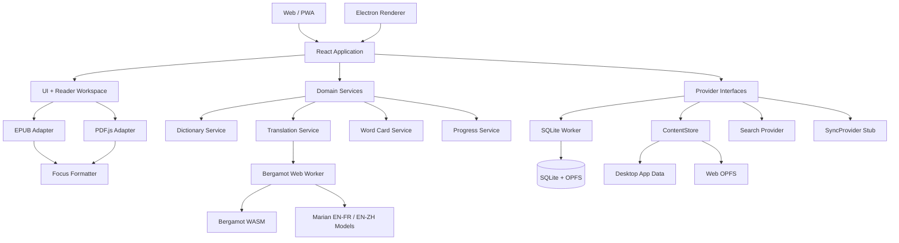

# LexiAnchor 技术架构

> 版本：v1.0
>
> 状态：技术路线基线
>
> 日期：2026-07-24
>
> 关联文档：[PRD.md](./PRD.md)、[DEVELOPMENT_WORKFLOW.md](./DEVELOPMENT_WORKFLOW.md)

## 1. 决策摘要

LexiAnchor 采用 TypeScript 优先的跨平台架构：

- 使用 React + TypeScript 构建共享 UI 和业务逻辑；
- 使用 Electron 构建 Windows/macOS 桌面应用；
- 使用 Vite 构建 Web/PWA；
- PDF 使用 PDF.js；
- EPUB v0.1 使用 EPUB.js 0.3.93，并通过 Reader Core adapter 隔离；
- 桌面与 Web 使用相同 SQLite schema、迁移和 Repository API；
- SQLite 在 Worker 中运行，持久化到 OPFS；
- 大型书籍、词典和模型通过统一 ContentStore 接口管理；
- v0.1 本地翻译在桌面/Web 共用的 Bergamot Web Worker 中执行；
- 离线资源优先级为英英、英法、英汉；
- 研发期使用私有 GitHub 仓库；
- 桌面构建不签名，以便携压缩包为主，但接受系统安全警告这一限制。

## 2. 架构目标

1. 最大化 Windows、macOS 和 Web 的代码共享。
2. 保持 EPUB/PDF 渲染和文本选择行为一致。
3. 保证无网络时仍可阅读、查词、保存进度和管理词卡。
4. 将词典、翻译、搜索、存储和未来同步实现为可替换提供者。
5. 将重计算任务移出 UI 线程，保证阅读和滚动流畅。
6. 使用用户容易理解的导入、导出和恢复机制。
7. 让只熟悉 Python 的维护者也能通过清晰边界和文档安全地使用 AI 协作开发。

## 3. 技术栈

| 层级 | 选型 | 状态 | 说明 |
| --- | --- | --- | --- |
| 语言 | TypeScript | 已确定 | 主代码统一使用严格模式 TypeScript |
| UI | React | 已确定 | 桌面和 Web 共享 |
| 构建 | Vite | 已确定 | Web 与 Electron renderer |
| 包管理 | pnpm workspace | 已确定 | Monorepo 与依赖锁定 |
| 桌面 | Electron | 已确定 | 内置 Chromium，降低跨平台渲染差异 |
| 桌面打包 | Electron Forge | 已确定 | 生成 Windows/macOS 构建产物 |
| Web | PWA | 已确定 | Service Worker 缓存应用壳与离线资源清单 |
| PDF | PDF.js 6.1.200 | 已确定（v0.1） | display layer、文本层、选词；通过 adapter 隔离 |
| EPUB | EPUB.js 0.3.93 | 已确定（v0.1） | 本地文件直读；通过 adapter 隔离并保留 Readium 迁移能力 |
| 数据库 | SQLite WASM 3.53.0 | 已确定（v0.1） | 自有 Worker；桌面/Web 使用相同 schema 和迁移 |
| 数据持久化 | OPFS `opfs-sahpool` | 已确定（v0.1） | 单写连接；不依赖 COOP/COEP；提供能力检测 |
| 桌面文件 | Electron main process | 已确定 | 书籍、词典和模型存放于应用数据目录 |
| Web 文件 | OPFS | 已确定 | 受浏览器配额和清理策略限制 |
| 本地推理 | Mozilla Bergamot WASM 0.4.9 | 已确定（v0.1） | 桌面/Web 共用 Worker；Provider 隔离未来后端 |
| 翻译模型 | Mozilla Firefox Translations | 已确定（v0.1） | EN→FR/EN→ZH `Release`、`base-memory` 量化模型 |
| 单元测试 | Vitest | 已确定 | 领域逻辑、格式转换、迁移 |
| E2E | Playwright | 已确定 | Web 与 Electron 核心流程 |
| CI | GitHub Actions | 已确定 | Windows、macOS、Web 构建和测试 |

依赖版本必须使用 lockfile 固定。不得在文档中写死“latest”，升级通过独立 Pull Request 完成。

Electron Forge 的 Vite 插件目前由官方标记为 experimental。Phase 0 可以使用它快速建立工程，但必须：

- 固定 Electron Forge、插件和 Vite 版本；
- 将 Vite 配置保留为独立模块，避免业务代码依赖 Forge 插件 API；
- 在首个可发布构建前验证 Windows/macOS 打包；
- 若插件稳定性不达标，改用独立 Vite 构建加 Forge 打包，不更换 React、TypeScript 或 Electron 主路线。

pnpm 11 默认阻止 Git 来源的间接依赖。Electron Forge 7.11.2 声明的
`@electron/rebuild` 3.x 会引入 Electron 官方 `@electron/node-gyp` Git commit，因此
工作区将 `@electron/rebuild` 覆盖到保留 Forge 所用命名 API 的 4.0.4。该版本移除了
Git 子依赖；覆盖兼容性由桌面打包任务验证，不关闭 pnpm 的供应链保护。
Electron Forge 打包同时要求 pnpm 使用 hoisted node linker，因此该设置保存在
`pnpm-workspace.yaml`，不得依赖开发者个人的全局配置。

## 4. 总体架构



## 5. Monorepo 结构

计划采用以下结构：

```text
LexiAnchor/
├── apps/
│   ├── desktop/                 # Electron main、preload、打包配置
│   └── web/                     # Web/PWA 入口
├── packages/
│   ├── app/                     # React 应用组合与路由
│   ├── ui/                      # 设计 token 和可访问组件
│   ├── domain/                  # 纯业务规则与实体
│   ├── reader-core/             # 阅读位置、选区、主题公共协议
│   ├── reader-epub/             # EPUB adapter
│   ├── reader-pdf/              # PDF.js adapter
│   ├── focus-formatting/        # 独立焦点加粗算法
│   ├── dictionary/              # 词典协议、索引、包格式
│   ├── translation/             # 本地/在线翻译路由
│   ├── storage/                 # schema、迁移、Repository
│   ├── platform/                # 桌面/Web 平台能力接口
│   ├── i18n/                    # 中英法资源
│   └── test-fixtures/           # 合法、最小化测试文档
├── docs/
│   ├── adr/
│   ├── spikes/
│   └── licenses/
├── scripts/                     # 资源构建与许可证清单
├── PRD.md
├── TECHNICAL_ARCHITECTURE.md
└── DEVELOPMENT_WORKFLOW.md
```

包之间必须保持单向依赖：

```text
apps → app/ui → domain/ports → adapters
```

`domain` 不得导入 Electron、DOM、PDF.js、EPUB 内核或具体数据库库。

## 6. Electron 边界与安全

### 6.1 进程职责

#### Main Process

- 创建窗口和处理全屏；
- 打开文件选择器；
- 管理桌面应用数据目录；
- 打开系统浏览器；
- 管理便携构建和版本信息；
- 通过白名单 IPC 暴露最小平台能力。

#### Preload

- 使用 `contextBridge` 暴露类型化 API；
- 不暴露任意文件路径读写、shell 命令或完整 Node API；
- 每个 IPC channel 都有固定参数 schema；
- 对返回值进行序列化和错误归一化。

#### Renderer

- 开启 context isolation；
- 开启 sandbox；
- 禁止 renderer 直接访问 Node；
- EPUB 内容运行在受限 iframe；
- 只通过 preload API 访问桌面能力。

### 6.2 Web Worker

Web 与 Electron renderer 使用独立 Worker：

- SQLite Worker；
- Bergamot 翻译 Worker；
- StarDict 导入 Worker；
- 所有长任务支持取消和进度事件。

Utility Process 是 Electron 后续隔离大内存任务的预留手段，不属于 v0.1 已实现基线。

## 7. 阅读内核

### 7.1 PDF

PDF.js 为确定选型，使用其 display layer 构建自定义阅读 UI：

- canvas/SVG 页面渲染；
- text layer 支持选择和查词；
- annotation layer 支持链接；
- 自定义虚拟化和页缓存；
- 不直接照搬 PDF.js 默认 viewer；
- 焦点加粗通过可撤销的文本层装饰实现；
- 原始 PDF 不被修改。

PDF 核心 Spike 已完成，证据记录在
[PDF 阅读内核 Spike](./docs/spikes/0002-pdf-engine.md) 与
[ADR-0003](./docs/adr/0003-reader-engines.md)：

- 文本层与视觉页面对齐通过；
- 150% 缩放、选词、焦点加粗和进度恢复通过；
- 中文、英文和法语重音字符通过；
- 无文本层页面按图片显示并禁用选词；
- 当前只渲染可见页，PDF reader 与 worker 按需加载；
- 100MB 级文档的内存和首屏时间仍待发布前验证。

### 7.2 EPUB

Spike 已完成，结果记录在
[EPUB 阅读内核 Spike](./docs/spikes/0001-epub-engine.md) 与
[ADR-0003](./docs/adr/0003-reader-engines.md)。v0.1 选择 EPUB.js 0.3.93：

| 指标 | 权重 |
| --- | --- |
| EPUB 2/3 与真实书籍兼容性 | 高 |
| 稳定、可序列化的阅读位置 | 高 |
| 样式和焦点加粗注入 | 高 |
| 选词、右键和上下文获取 | 高 |
| 分页/滚动切换 | 中 |
| 无障碍语义 | 高 |
| 维护活跃度与许可证 | 高 |
| Web/Electron 共用难度 | 高 |

- 本地 `.epub` 可作为 URL 或 `ArrayBuffer` 直接打开；
- CFI、分页/滚动、排版样式、选词和焦点加粗通过浏览器测试；
- EPUB 2 与 EPUB 3 项目自制夹具均通过；
- 具体 API 只存在于 `@lexianchor/reader-epub`；
- 默认关闭 EPUB 脚本和弹窗。

Readium Web 维护更活跃，但其 TypeScript navigator 需要 RWPM、positions list 与 HTTP 资源。
这与 v0.1 的浏览器本地文件直读边界不匹配。保留编译探针，等项目引入出版物服务或远程书库时
重新评估。

### 7.3 焦点加粗

`focus-formatting` 是纯函数包：

- 输入为原始 token 和设置；
- 输出为不改变原始文本的 decoration 描述；
- 不依赖 “Bionic Reading®” 字体、代码、参数或资产；
- EPUB/PDF 分别实现 decoration adapter；
- 复制、搜索、选词和屏幕阅读器始终使用原文。

## 8. 本地数据一致性

### 8.1 一致性的定义

Web 与桌面必须保持：

- 相同实体字段；
- 相同 SQLite schema；
- 相同迁移编号；
- 相同 Repository 接口；
- 相同排序、去重和软删除规则；
- 相同导入/导出数据包格式；
- 相同用户可见行为。

平台差异只允许存在于物理文件容器：

- 桌面书籍/模型：应用数据目录；
- Web 书籍/模型：OPFS；
- 两端数据库：SQLite WASM + OPFS。

### 8.2 数据库线程

- SQLite 只在专用 Worker 中打开；
- 默认单写连接；
- UI 通过类型化消息调用 Repository；
- 迁移在应用启动时、打开业务页面前执行；
- 迁移失败进入只读恢复界面；
- 不直接同步 `.sqlite3` 文件。

存储 Spike 已完成，见
[SQLite WASM + OPFS 存储 Spike](./docs/spikes/0003-sqlite-opfs.md) 与
[ADR-0002](./docs/adr/0002-local-first-storage.md)。v0.1 使用
`@sqlite.org/sqlite-wasm` 3.53.0-build1 的 `opfs-sahpool`，避免普通 OPFS VFS
对 COOP/COEP 响应头的要求。持久化不可用时只允许明确的内存降级。

Schema v2 增加 `word_cards`。词卡保存词语、规范化词语、词性、英语释义、可空词根/词源、
词典来源、来源书籍、原句、创建/更新时间、软删除时间和同步版本。相同词语、来源书籍和原句
的活动词卡通过部分唯一索引去重；删除保留 tombstone，而不是立即丢失同步语义。

### 8.3 大文件

数据库保存元数据、索引和引用，不保存 EPUB/PDF/模型完整二进制。

`ContentStore` 提供：

- `put`
- `get`
- `openStream`
- `delete`
- `verifyChecksum`
- `getUsage`

书籍使用内容哈希去重。删除书籍时只有在无其他引用后才删除二进制。

### 8.4 导出与未来同步

导出包采用版本化结构：

```text
lexianchor-export.zip
├── manifest.json
├── data.jsonl
├── covers/
└── optional-content/
```

- 默认导出设置、进度和词卡；
- 书籍文件由用户选择是否包含；
- 未来同步传输领域记录和变更事件，不传输数据库文件；
- `SyncProvider` 在 MVP 中仅保留接口和测试替身。

## 9. 词典架构

### 9.1 资源优先级

1. 英英；
2. 英法；
3. 英汉。

### 9.2 初始候选

| 类型 | 首选候选 | 分发策略 | 状态 |
| --- | --- | --- | --- |
| 英英 | Princeton WordNet 3.1 | 随应用分发 | 已实现并通过离线查询、许可与完整性验证 |
| 英法 | FreeDict `eng-fra` 0.1.6 | 应用内按需下载 | 已实现，固定来源、大小与 SHA-256，支持卸载 |
| 英汉 | FreeDict/WikDict `eng-zho` 2025.11.23 | 应用内按需下载 | 已实现，CC-BY-SA-3.0；自动生成质量提示 |
| 词根/词源补充 | Wiktionary/Kaikki 数据 | 独立可选包 | 需处理署名和 ShareAlike |

不得将“仓库公开”视为数据可自由再分发。每个包必须携带：

- `manifest.json`
- 来源 URL；
- 版本和构建时间；
- 许可证全文或链接；
- attribution；
- SHA-256；
- schema 版本。

### 9.3 包格式

WordNet 3.1 的内置基线保留上游有序 index/data 文件，通过字节偏移只读查询。它由
`@lexianchor/dictionary` 的 `DictionaryProvider` 隔离，结果结构不暴露具体格式；PWA
预缓存完整资源，Electron 使用相同构建资产。资源清单和完整声明分别保存在
`packages/dictionary/resources` 与 `docs/licenses`。

FreeDict `eng-fra` 0.1.6 与 FreeDict/WikDict `eng-zho` 2025.11.23 是 v0.1 的按需 TEI
资源例外：应用从固定 upstream commit 下载，在写入 OPFS 前核对大小与 SHA-256，并验证能够
解析出词条。安装后仅从 OPFS 读取，首次查询按会话解析并缓存索引。完整英法 8,799 词条在
当前开发机约 43 ms；英汉资源包含 26,660 个源词条，完整解析性能由资源 Spike 持续记录。
若后续双语包体积或数量继续增加，将解析迁移到 Worker 或在资源构建阶段转换为只读
SQLite，上层 `DictionaryProvider` 无需变化。

ECDICT 仓库本身标记 MIT，但 README 描述其释义和音标由多种资料、网络抓取与网友词库汇总，
没有为每类数据提供足够清晰的权利链。它不进入 LexiAnchor 官方下载清单；未来只能作为用户
自行导入的外部资源候选，不能用仓库级许可证替代数据来源审计。

其他较大 LexiAnchor 官方词典仍统一转换为只读 SQLite 包。用户导入优先支持：

1. StarDict（v0.1 已支持未压缩 `.ifo + .idx + .dict`，后台校验后写入 OPFS）；
2. LexiAnchor Dictionary Package；
3. MDX/MDD 在 P1 调研。

导入在 Worker 中完成，并写入新的临时数据库；只有校验和索引成功后才原子替换。

实现与验收证据见
[WordNet 离线英英词典 Spike](./docs/spikes/0004-wordnet.md) 与
[FreeDict 英法词典 Spike](./docs/spikes/0005-freedict-eng-fra.md) 以及
[FreeDict/WikDict 英汉词典 Spike](./docs/spikes/0006-freedict-eng-zho.md)、
[StarDict 用户词典导入 Spike](./docs/spikes/0007-stardict-import.md)、
[ADR-0004](./docs/adr/0004-dictionaries-and-translation.md)。

## 10. 翻译架构

### 10.1 能力顺序

- 单词：本地词典；
- 短语/句子：本地翻译模型；
- 用户主动选择后：在线翻译；
- 始终提供 Search on Web。

### 10.2 执行后端

v0.1 的 Web/PWA 与 Electron renderer 共用：

- `@browsermt/bergamot-translator` 0.4.9；
- 独立 Web Worker 与约 5.2 MB WASM；
- Mozilla Firefox Translations 的量化 Marian 模型；
- OPFS 模型存储、模型 manifest、语言路由和 `BergamotTranslationProvider`；
- 能力不足或模型未安装时的在线翻译与 Search on Web 降级。

这使两端模型文件、推理结果和存储生命周期保持一致。若后续 Electron 出现必须隔离的内存或
崩溃问题，可把同一 Provider 后端迁移到 Utility Process；产品 UI 不直接依赖 Worker 或
Bergamot。ONNX Runtime/Transformers.js 只保留为未来增加语言方向时的候选实现。

### 10.3 模型管理

- 模型按需下载，不进入 Git；
- 首批句子翻译方向为英→法、英→简中；
- EN→FR 下载 25.8 MB、解压约 36.7 MB；
- EN→ZH 下载 36.7 MB、解压约 49.9 MB；
- 每个压缩与解压文件都核对固定大小和 SHA-256；
- 支持暂停、完成文件复用、继续、取消和删除；
- 下载前显示体积、许可证和预计磁盘占用；
- 完整资源通过真实浏览器安装、推理、重载和断网复用验证。

“英英”通过词典释义实现，不把生成式英语改写当成权威词典结果。

实现与审计证据见
[Mozilla Bergamot 本地句子翻译 Spike](./docs/spikes/0008-bergamot-local-translation.md) 与
[ADR-0004](./docs/adr/0004-dictionaries-and-translation.md)。

## 11. UI 与状态

- 设计 token 使用 CSS variables；
- 组件优先使用可访问的 headless primitives；
- 持久状态只通过 Repository；
- 短期 UI 状态使用轻量 store；
- 不将书籍正文或大模型状态放入全局 React state；
- 阅读位置写入节流，但在关闭、失焦和章节切换时立即 flush；
- 国际化资源使用稳定 key，英文为缺失回退。

UI 库在实现前做最小 Spike，优先考察 React Aria Components；不得一次引入多个重叠组件库。

## 12. 网络与隐私

默认允许的网络请求只有用户明确触发的：

- 下载词典；
- 下载模型；
- 在线翻译；
- Search on Web；
- 手动检查更新或打开项目网页。

约束：

- 不默认遥测；
- 不上传整本书；
- 不在日志记录完整选文；
- 在线翻译提供者通过 adapter 接入；
- API key 不进入 renderer bundle 或 Git；
- 所有下载资源校验哈希；
- EPUB 外部资源默认阻止或询问。

## 13. 平台与发布

### 13.1 最低目标

- Windows 10 22H2、Windows 11；
- macOS 13+；
- Chrome、Edge、Firefox、Safari 最近两个主要版本；
- 移动 Web 保证基础可用，不作为 P0 重点。

### 13.2 无签名构建

按当前决策不配置 Windows/macOS 代码签名：

- Windows 发布便携 ZIP；
- macOS 发布应用 ZIP；
- GitHub Actions 构建产物附带 SHA-256；
- 不承诺完全无安全警告；
- 不启用依赖签名信任链的静默自动更新；
- Web/PWA 作为安装摩擦最低的交付方式。

如果未来面向普通公众分发，应重新评估签名。Apple 和 Electron Forge 均建议公开分发进行签名/公证。

## 14. 测试架构

### 14.1 单元测试

- 焦点加粗 tokenization；
- 阅读进度转换；
- 词卡去重；
- 词典排序；
- 翻译路由；
- schema migration；
- ContentStore 引用计数；
- locale 回退。

### 14.2 集成测试

- SQLite Worker + Repository；
- 词典包导入；
- 模型 manifest 和校验；
- EPUB/PDF adapter；
- Electron IPC schema；
- 数据导出/导入往返。

### 14.3 E2E

至少覆盖：

1. 导入 EPUB；
2. 阅读并保存进度；
3. 切换焦点加粗；
4. 查词；
5. 添加词卡；
6. 重启并恢复；
7. PDF 选词；
8. 离线模式；
9. Web 数据导出。

测试文档必须可合法提交到仓库，并尽量小而具代表性。

## 15. 技术 Spike 与决策门

| Spike | 产出 | 通过标准 |
| --- | --- | --- |
| EPUB 内核 | 对比报告、demo、ADR 更新 | 真实样本兼容、位置稳定、可注入样式和选词 |
| PDF 文本层 | demo、性能数据 | 缩放后对齐、选词可用、无文本层可降级 |
| SQLite WASM | Web/Electron demo | 同一迁移、重启保留、导出恢复 |
| 词典包 | 三类候选样本 | 查询速度、字段覆盖、许可证可追踪 |
| 本地翻译 | EN→FR/EN→ZH benchmark | 质量可接受、UI 不阻塞、模型许可明确 |
| 无签名发布 | Win/mac 实机记录 | 可运行且安全提示被准确记录 |

Spike 代码可以丢弃；结论必须进入 `docs/spikes/` 和 ADR。

## 16. 参考资料

- [Electron 官方文档](https://www.electronjs.org/docs/latest/)
- [Electron Forge](https://www.electronforge.io/)
- [Electron Forge Vite 插件](https://www.electronforge.io/config/plugins/vite)
- [Tauri 架构（备选路线参考）](https://v2.tauri.app/concept/architecture/)
- [PDF.js](https://mozilla.github.io/pdf.js/)
- [Readium Web](https://readium.org/web/)
- [EPUB.js](https://github.com/futurepress/epub.js/)
- [SQLite WebAssembly](https://sqlite.org/wasm/doc/trunk/index.md)
- [SQLite OPFS 持久化](https://sqlite.org/wasm/doc/tip/persistence.md)
- [Bergamot Translator](https://github.com/browsermt/bergamot-translator)
- [Firefox Translations models](https://github.com/mozilla/firefox-translations-models)
- [Princeton WordNet 许可证](https://wordnet.princeton.edu/license-and-commercial-use)
- [FreeDict 许可证说明](https://freedict.org/documentation/)
- [WikDict 下载与许可证](https://www.wikdict.com/page/download)
- [ECDICT（已审计但不进入官方清单）](https://github.com/skywind3000/ECDICT)
